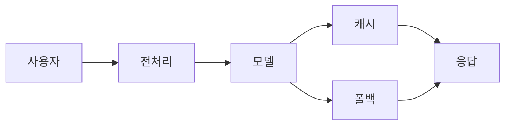

# Marp 가이드 — DAMI Lab 스타일

이 가이드는 **DAMI Lab의 PPT 양식**(산업공학과세미나 템플릿)을 Marp로 구현하는 방법입니다.

## 철학

- **CSS는 레이아웃 프리셋 담당** — `.title`, `.toc`, `.section`, `.end` 같은 슬라이드 타입을 미리 만들어두고,
- **본문은 깔끔한 마크다운** — `<!-- _class: title -->` 한 줄로 스타일 선택
- **DAMI Lab 정체성 반영** — 네이비 h1 border-left, `■ • – »` 불릿 위계, 우상단 코끼리 로고, 고정 푸터
- **덱 2(22px)보다 작은 글씨(18px)** — 정보 밀도 높임

본문에 `<div style="...">` 같은 인라인 HTML을 거의 쓰지 않아도 되도록 설계했습니다.

### 기본 슬라이드 레이아웃 (강조.png 패턴)

본문 슬라이드의 **디폴트** 구조는 상하 흐름:

1. **본문 텍스트 (필수, 가장 먼저)** — h1 제목 바로 다음에 **반드시 `## h2` + 불릿 3개 내외** 의 intro 가 들어간다. Plain paragraph 금지 (DAMI Lab 양식의 기본 단위가 `## h2` + bullet list 임). h2 는 `## 정의 / ## 개요 / ## 구조 / ## 상황 / ## 역할 / ## 컨셉 / ## 매핑` 같은 short header.
2. **표 또는 다이어그램** — 본문 아래 공백 또는 우측 공백에
3. **강조 callout** — 남는 공백에 빨간 박스로 emphasis

**표/flow-row/cols-2/코드블록으로 슬라이드 시작 금지**. "5단계 파이프라인" 같은 명확한 제목이어도 `## h2` intro 먼저. Plain paragraph 로 intro 넣는 것도 금지 — 반드시 h2 + bullet 양식.

**예시**:
```markdown
# 슬라이드 제목

## 개요

- 핵심 명제 1
- 핵심 명제 2
- 핵심 명제 3

[이후 표 / flow-row / cols-2 등 시각 요소 + callout]
```

`cols-2` 는 **진짜 비교**가 필요할 때만 (Before/After, 기존/신방식, 두 개념 병렬). 모든 슬라이드에 기계적으로 적용하면 본문 가독성 떨어지고 단조로워짐.

### 콘텐츠 Overflow 절대 금지 (하드 룰)

- 슬라이드 아래쪽이 잘려 보이면 **무조건 수정**. 내용 축약 또는 슬라이드 분할.
- 본문 슬라이드 세로 가용 약 **530px** (canvas 720 - padding 30/56 - h1 블록 83). cols-2 한 쪽 10+ bullet 이면 거의 overflow.
- 빌드 후 **pdftoppm 으로 전 슬라이드 렌더 스캔 필수**.

**참고 이미지** (`.claude/skills/marp/참고양식/`):
- `본문강조양식.png` — 기본 본문 패턴 (본문 + 표 + 우측 빨간 callout)
- `본문플로우차트양식.png` — flow-row + flow-box 레이아웃 예시
- `본문추가설명양식.png` — 본문 옆에 작은 메모/부가 설명
- `본문코드양식.png` — 코드 블록 + 연결 다이어그램

---

## 설치 (이미 완료)

```bash
nvm use --lts           # 새 터미널에서 node 활성화 (bashrc 자동)
marp --version          # 확인: v4.3.1 설치됨
```

---

## 사용 흐름

> **소스 문서(roadmap.md, spec.md 등) 기반 덱이면 시작 전 outline 승인 필수**:
> 1. 간단한 outline 작성 — 번호, 제목, 핵심 한 줄, 사용 유틸리티(`cols-2`/`flow-row`/`callout` 등), `.section` break 포함 여부
> 2. outline 을 사용자에게 **먼저 제시**하고 OK 받은 뒤 본문 작성 시작
> 3. 덱 규모가 25장 이상이면 [patterns/building-large-decks.md](patterns/building-large-decks.md) 의 chunk + subagent 병행
>
> **Chunking 간단 규칙** (과잉 분석 금지):
> - 슬라이드는 **가급적 꽉 채우기** (thin 빈 느낌 피하기)
> - 단, **한 슬라이드에 너무 다른 성격의 내용 섞지 말 것** (주제 하나에 집중)
>
> 소스 없이 대화만으로 만드는 덱은 이 규칙 예외.

1. 새 프로젝트 폴더 만들기 (`ppt_generation/projects/<YYYY-MM-DD-이름>/`)
2. 로고 파일 2개 복사
   ```bash
   cp .claude/skills/marp/assets/dami_logo.png      ppt_generation/projects/<name>/assets/
   cp .claude/skills/marp/assets/dami_logo_full.png ppt_generation/projects/<name>/assets/
   ```
3. 논문 인용이 있으면 `refs.toml` 복사 후 편집
   ```bash
   cp .claude/skills/marp/refs.example.toml ppt_generation/projects/<name>/refs.toml
   ```
4. `<deck-name>.md` 작성 (파일명은 내용 반영한 영문 kebab-case, `slides.md` 같은 generic 이름 금지) — 맨 위에 아래 "프론트매터 템플릿" 복붙, 본문은 `<!-- _class: ... -->` 로 타입 지정
5. 빌드
   ```bash
   python3 .claude/skills/marp/bin/build.py ppt_generation/projects/<name>/<deck-name>.md
   ```
   (`build.py`는 `{{cite:키}}` placeholder를 `refs.toml` 의 항목으로 치환한 뒤 marp 실행)
6. (선택) 미리보기 PNG 생성 — `pages/` 서브폴더에 정리
   ```bash
   mkdir -p pages && pdftoppm -r 100 <deck-name>.pdf pages/page -png
   ```

**덱이 25장 이상으로 클 것 같으면** → [patterns/building-large-decks.md](patterns/building-large-decks.md) 의 outline → chunk → subagent → 병합 워크플로우 따를 것.

**사용자가 슬라이드에 신문기사를 인용/추가해달라고 하면** → [patterns/newspaper-clip/README.md](patterns/newspaper-clip/README.md) 무조건 먼저 읽고 그 워크플로우(WebSearch → og:image 다운로드 → 8가지 변형 중 선택 → CSS+HTML 복붙) 따를 것. CSS·마크업 정답지는 같은 폴더의 `slides.md`.

**사용자가 슬라이드에 국가별 라벨/국기를 표기해달라고 하면** → [patterns/country-flags/README.md](patterns/country-flags/README.md) 보고 G20 + EU 20개 SVG 국기 (`flags/<code>.svg`) 와 4가지 마크업 패턴(인라인·카드·카탈로그·타임라인) 사용. 사이즈 클래스: `flag-xs/sm/(default)/lg/xl`. CSS·마크업 정답지는 같은 폴더의 `slides.md`.

**사용자가 여러 국가의 정책·제도·통계를 비교 정리해달라고 하면** → [patterns/country-comparison/README.md](patterns/country-comparison/README.md) 보고 4가지 비교 레이아웃(overview-bar / policy-cards / timeline / comparison-table) 사용. 워크플로우: WebSearch 로 국가별 5요소(법명·일자·강제력·적용·의무) 수집 → 1+2 또는 1+4 또는 풀세트로 narrative 구성. `country-flags` 의 SVG 자동 활용. 마스터 예시: AI 보안 정책 5개국.

**사용자가 그림에 캡션 / 번호를 달아달라고 하면** → [patterns/figure-caption/SKILL.md](patterns/figure-caption/SKILL.md) 보고 메시지 중심 캡션 작성 + 그림 흰여백 자동 trim. 빌드는 `build_figcap.py` 한 번에 (prebuild + marp + cleanup, `.numbered.md` 자동 삭제). 캡션 어미 "~다" / 끝 마침표 금지, Left/Center/Right 콜론 형식.

**사용자가 슬라이드에 학회 로고 / publication venue 를 표기해달라고 하면** → [patterns/conference-logos/README.md](patterns/conference-logos/README.md) 보고 12개 AI/CS 학회 자산 (NeurIPS · ICML · ICLR · AAAI · IJCAI · KDD · CVPR · ICCV · ECCV · ACL · EMNLP · SIGMOD) + 8가지 layout 패턴 사용. 자주 쓰는 컴포넌트: `.unified-card` (학회 catalog 카드), `.paper-card-grid(-compact)` (논문 highlights), `.pub-timeline` (시간순), `.vt-timeline` (수직 마일스톤), `.pub-heatmap` (학회×연도), `.hero-conf` (단일 hero 표지). 자산이 stale 하면 `download_official.sh` 재실행. 마스터 예시: `slides.md`, 활용 예시: `examples/robot-safety-flow.md`.

---

## 슬라이드 타입 5가지

| 클래스 | 용도 | 배경 | 로고 |
|---|---|---|---|
| `.title` | 표지 (첫 슬라이드) | 네이비 단색 | 풀 로고 (`dami_logo_full.png`) |
| `.toc` | 목차 | 흰색 | 심플 (`dami_logo.png`) |
| `.section` | 섹션 구분 (챕터 전환) | 상단 63% 네이비 + 하단 37% 흰색 | 없음 |
| (클래스 없음) | 일반 본문 | 흰색 | 심플 |
| `.end` | 마지막 (Thank you) | 흰색 | 심플 |

> 모든 슬라이드는 **단색 배경**만 사용합니다. `linear-gradient` 는 쓰지 않습니다 (PDF 뷰어마다 그라데이션 경계가 블러/앤티에일리어스 차이가 나서 설계 의도와 다르게 보이는 사고가 있었음).

---

## 프론트매터 템플릿 (복붙용)

slides.md 맨 위에 아래 블록만 붙이면 DAMI Lab 양식이 자동 적용됩니다. 스타일 CSS 는 `theme: dami-lab` 로 참조되며, `build.py` 가 `--theme-set .claude/skills/marp/themes/dami-lab.css` 로 marp 에 등록해 줍니다.

```yaml
---
marp: true
theme: dami-lab
paginate: true
math: katex
footer: '동국대학교 컴퓨터·AI학과 DAMI Lab'
---
```

**덱별 커스터마이즈가 필요할 때**: 프론트매터에 `style: |` 블록을 추가하면 테마 CSS 뒤에 cascade 되어 덮어씁니다.

```yaml
---
marp: true
theme: dami-lab
paginate: true
style: |
  section h1 { font-size: 1.5em; }   /* 이 덱만 h1 작게 */
---
```

**테마 파일 위치**: [.claude/skills/marp/themes/dami-lab.css](themes/dami-lab.css). 수정하면 모든 덱에 즉시 반영됨 (단일 진실 원천).

---

## 슬라이드 클래스 레퍼런스 (예시)

### 1. `.title` — 표지 슬라이드

DAMI Lab 양식의 첫 장: 네이비 풀블리드 배경, 상하 흰색 수평선 사이에 제목, 우하단 발표자/기관, 좌하단 날짜, 우상단 풀 로고.

```markdown
<!-- _class: title -->
<!-- _paginate: false -->

# Safety and Planning for<br>Industrial Embodied Agent

<div class="author">Woojin Lee<br>Dongguk University</div>
<div class="date">2026.04.16</div>
```

- 제목이 두 줄이면 `<br>` 로 줄바꿈 강제
- 발표자 정보는 `<div class="author">` 로 감싸기 (줄바꿈은 `<br>`)
- 날짜는 `<div class="date">`
- `_paginate: false` 로 표지엔 페이지 번호 안 나오게

---

### 2. `.toc` — 목차

상단 큰 네이비 "Contents" 제목, 1/2/3/4 번호 + bold 섹션명, 하위 `■` 불릿.

```markdown
<!-- _class: toc -->

# Contents

1. Introduction
   - Embodied AI
   - LLM / VLM / VLA
2. Embodied Environment and Tasks
3. Safety in Embodied AI
   - Previous Works
   - Ongoing Works
4. Planning in Embodied AI
```

- `1.` `2.` `3.` 순서는 자동 카운터로 렌더 (markdown의 `1.`도 그대로 OK)
- 하위 항목(`-`)은 자동으로 `■` 불릿 적용

---

### 3. `.section` — 섹션 전환

챕터 구분용. **상단 63% 네이비 + 하단 37% 흰색** 2단 구조, 흰 제목이 경계 부근(bottom 41%)에 배치.

```markdown
<!-- _class: section -->

# 2. Embodied Environment and Tasks
```

- 제목만 있고 본문 없음. 챕터 첫 슬라이드로 사용.
- 번호를 제목에 넣으면 목차와 일관성 ↑
- `::before` 의사요소가 상단 네이비 바로 쓰이므로 **우상단 코끼리 로고는 섹션 슬라이드엔 표시되지 않음** (의도된 동작)
- 절대 풀블리드 단색으로 되돌리지 말 것 — DAMI Lab 양식은 2단 분할이 표준

---

### 4. 기본 본문 슬라이드 (클래스 없음)

흰 배경 + 네이비 제목(왼쪽 border + 하단 파란 밑줄), `■ / • / – / »` 4단 불릿 위계.

```markdown
# Introduction

## Embodied AI

- 정의
  - 물리적/가상 환경에서 **센서와 actuator**를 통해 상호작용하며 학습하는 AI

## 차이점

- Disembodied AI
  - 텍스트/이미지 같은 정적 데이터 기반 학습
  - 환경과 직접 상호작용하지 않음
- Embodied AI
  - 실제 환경과 상호작용
  - 환경 변화에 실시간 대응
    - 다양한 multi-modal 정보 활용

## 적용 사례

- 로봇 제어 (산업용, 가정용)
- 자율 주행 (자동차, 드론)
- 가상 환경 (메타버스, 게임 NPC)
```

---

### 5. 논문 인용 — 본문 `[1]` + 하단 참고문헌

본문에 `[1]` 대괄호 번호, 슬라이드 맨 아래 작은 글씨로 레퍼런스.
**인용은 `refs.toml`에 한 번만 적고 `{{cite:키}}` 로 가져옴** (단일 진실 원천).

```markdown
# Embodied LLM

## 특징

- 자연어 기반으로 맥락·명령을 이해하고 실행 가능한 계획을 생성하는 LLM 기반 시스템 [1]
- Action executor가 필요함 — 계획을 실제 행동으로 변환하는 인터페이스 [2]

## 관련 논문

- **ReAct** (ICLR 2022) [1]
  - 추론 능력 추가를 통한 고도화된 계획 생성
- **LLM-Planner** (ICCV 2023) [2]
  - 언어 명령을 기반으로 계획 생성

<div class="refs">

[1] {{cite:yao2022react}}
[2] {{cite:song2023llmplanner}}

</div>
```

**핵심 규칙**
- `<div class="refs">` 다음 줄과 닫는 `</div>` 앞 줄은 **반드시 빈 줄** (마크다운 렌더 규칙)
- 인용문은 `refs.toml` 에 저장 → 자동 치환
- 여러 슬라이드에서 같은 논문 쓸 때 **포맷이 자동으로 통일**됨
- 인용문 아래에 구분선이 그어지고, 그 아래 푸터가 나옴

**실전 팁 1 — 인용 번호는 전체 덱에서 순차적으로**

슬라이드마다 하단에 `[1]`로 시작하지 말고, **덱 전체에서 1부터 이어지는 전역 번호**로 매긴다.
예: TLO 슬라이드 → `[1]`, QSA 슬라이드 → `[2]`, CHIO → `[3]`, … 마지막 알고리즘 → `[N]`.

- 본문의 `[n]` 마커와 하단 `<div class="refs">` 안의 `[n] {{cite:키}}` 번호를 **일치**시킨다.
- 동일 논문을 여러 슬라이드에서 재인용할 때는 **이미 할당된 번호를 재사용** (새 번호 부여 X).
- 이렇게 해야 마지막 References 페이지(아래 팁 2)와 번호가 자연스럽게 이어진다.
- 작성 중에는 임시로 `[1]`만 써두고, 완성 직전에 알고리즘/섹션 순서대로 `[1]…[N]`으로 한 번에 리넘버링하는 것이 제일 편하다.

**실전 팁 2 — 마지막 Thank you 앞에 `References` 통합 페이지**

여러 논문을 인용한 덱에서는 `.end` (Thank you) 바로 앞에 **References 슬라이드**를 하나 두어 모든 인용을 한 페이지에 모아준다. 각 슬라이드 하단 `div.refs`와 **중복이지만**, 청중이 발표 후 한눈에 출처를 확인할 수 있어 자문·세미나 발표에서 권장된다.

```markdown
# References

<div style="font-size: 0.72em; line-height: 1.55;">

[1] {{cite:rao2011}}

[2] {{cite:zhang2018}}

[3] {{cite:albetar2021}}

...

[15] {{cite:russell2010}}

</div>

---

<!-- _class: end -->

# Thank you
```

- 인용이 많으면 `font-size: 0.65em` 정도로 더 줄이거나 `column-count: 2` 로 2단 배치.
- 번호는 팁 1의 전역 순서와 **정확히 일치**해야 한다.
- 각 항목 사이에 **빈 줄**을 둔다 (마크다운에서 `{{cite:}}` placeholder가 독립 문단으로 렌더되도록).

---

### 6. `.end` — 마지막 슬라이드 (Thank you)

```markdown
<!-- _class: end -->

# Thank you
```

- 흰 배경에 가운데 큰 검정 제목
- 우상단 심플 로고는 그대로 유지

---

## 인용 관리 시스템

### 왜 `refs.toml` + placeholder 인가

이전 슬라이드에서는 같은 논문을 여러 번 인용할 때 매번 손으로 적어서 포맷이 제각각이 됐습니다. 이제는:

- **단일 진실 원천**: `refs.toml`에 논문 메타데이터(저자·제목·저널·권·호·쪽·연도)를 한 번만 적음
- **placeholder 참조**: 슬라이드에서 `{{cite:rao2011}}` 로 호출
- **통일된 포맷**: `build.py` 가 모든 인용을 동일한 형식으로 변환

### `refs.toml` 형식

```toml
[rao2011]
authors = "Rao, R. V., Savsani, V. J., & Vakharia, D. P."
title = "Teaching–learning-based optimization: A novel method for constrained mechanical design optimization problems"
venue = "Computer-Aided Design"
volume = 43
issue = 3
pages = "303–315"
year = 2011
```

**필드**
| 필드 | 필수 | 설명 |
|---|---|---|
| `authors` | ✅ | 쉼표로 구분된 저자명 (마지막 점 `.`은 자동 처리) |
| `title` | ✅ | 논문 제목 (끝의 점 `.` 자동 제거) |
| `venue` | ✅ | 저널명 또는 학회명 (렌더 시 `*이탤릭*`) |
| `volume` | | 저널 권 (선택) |
| `issue` | | 저널 호 (선택) |
| `pages` | | 쪽 번호 (예: `"303–315"`) |
| `year` | ✅ | 연도 |
| `raw` | | 이걸 쓰면 위 필드 대신 문자열 전체가 그대로 사용됨 |

### 치환 결과 (포맷 예시)

```
Rao, R. V., Savsani, V. J., & Vakharia, D. P. "Teaching–learning-based optimization: A novel method for constrained mechanical design optimization problems." *Computer-Aided Design*, 43(3), 303–315, 2011.
```

모든 슬라이드에서 동일한 형식이 나옴. 포맷을 바꾸고 싶으면 `build.py` 의 `format_citation` 함수만 수정.

### 빌드 방법

```bash
# 기본 (PDF)
python3 .claude/skills/marp/bin/build.py ppt_generation/projects/<name>/slides.md

# PPTX
python3 .claude/skills/marp/bin/build.py ppt_generation/projects/<name>/slides.md --format pptx

# HTML
python3 .claude/skills/marp/bin/build.py ppt_generation/projects/<name>/slides.md --format html

# 디버깅: 치환된 중간 파일 유지
python3 .claude/skills/marp/bin/build.py ppt_generation/projects/<name>/slides.md --keep-built
```

빌드 결과는 `slides.md` 와 같은 폴더에 `slides.pdf` 로 저장됩니다.

---

## 자주 쓰는 팁

### 이미지 크기 조정
```markdown
         <!-- 가로 400px -->
          <!-- 세로 300px -->
  <!-- 오른쪽 40% 배경 -->
```

### `.flow-row` / `.flow-box` 올바른 구조 — `.header` + `.body` 필수

`.flow-box` 는 **반드시 `<div class="header">` + `<div class="body">` 자식 구조**. raw text 만 넣으면 padding 이 0 이라 텍스트 상단이 box border 에 의해 clip 됨. **화살표는 CSS `::before`/`::after` 로 자동 생성**되므로 `<div class="flow-arrow">→</div>` 같은 수동 화살표 금지 (중복 렌더).

```html
<div class="flow-row">

<div class="flow-box">
<div class="header">1. 제목</div>
<div class="body">

- 본문 항목 A
- 본문 항목 B

</div>
</div>

<div class="flow-box">
<div class="header">2. 제목</div>
<div class="body">한 줄 본문도 OK</div>
</div>

</div>
```

- 각 태그 전후에 **빈 줄** (마크다운 내부 렌더 위해)
- 박스 갯수 3~4개가 적정 (더 많으면 horizontal squish)
- 짧은 한 줄 본문이면 `.body` 안에 텍스트만 써도 됨 (리스트 안 쓸 땐 빈 줄 생략 가능)

(상세: [lessons.md](lessons.md#flow-box-structure))

### 수식 (KaTeX)
```markdown
인라인: $E = mc^2$

블록:
$$
X_{\text{new},i} = X_i + r \cdot (X_{\text{teacher}} - T_F \cdot \bar{X})
$$
```

### 발표자 노트 (PPTX 변환 시 노트에 들어감)
```markdown
## 본문

<!-- 여기는 발표자 노트입니다. 화면엔 안 보임. -->
```

### `section` 배경에는 `!important` 필수

Marp `default` 테마의 `background-color` 가 cascade 에서 이겨서, 사용자 `style:` 블록이 뒤에 와도 덮어쓰지 않으면 안 보임. base `section` 과 `.title`/`.section`/`.end` 모두 `background: ... !important` 로 걸어야 한다. base 에 `!important` 걸면 하위 클래스에도 전부 필수. (상세: [lessons.md](lessons.md#background-important))

### `::before` / `::after` 재활용 시 base 속성 전부 재선언

base `section::before` 가 로고용으로 `width: 56px; height: 46px; top/right; background: url(...)` 를 걸어둠. 하위 클래스(`.section::before` 등)에서 재활용할 때 `width`, `height`, `top/right/bottom/left`, `background`, `background-image: none` 을 **전부 명시적으로 덮어써야** 한다. 하나라도 빠지면 base 속성이 cascade 로 살아남아 엉뚱한 위치/크기로 렌더됨 (대표 증상: 상단 네이비 바가 왼쪽 56px 좁은 막대로만 나옴). (상세: [lessons.md](lessons.md#before-after-재활용))

### `linear-gradient` 금지, 단색/`border-left` 로 대체

PDF 렌더 엔진(poppler / Chromium / Adobe) 마다 hard stop 해석이 달라 출력이 불안정. 좌측 네이비 바가 필요하면 h1 `border-left: 6px solid navy` 로 처리한다 (전체 style 블록에 이미 적용). (상세: [lessons.md](lessons.md#linear-gradient-금지))

### 한글 폰트가 깨질 때
- 시스템에 `Pretendard` 또는 `Noto Sans KR` 필요
- 설치: `sudo apt install fonts-noto-cjk`

### 본문 h1 상단 정렬 — `justify-content: flex-start !important` 필수

Marp `default` 테마의 세로 중앙정렬 때문에 콘텐츠 양에 따라 h1 Y좌표가 슬라이드마다 달라짐. base `section` 에 `justify-content: flex-start !important` + `padding: 8px 56px 56px 68px` 로 고정 (전체 style 블록에 포함). **`.end` 는 반대로 `display: flex !important; justify-content: center !important`** 를 명시적으로 붙여야 base 를 덮고 가운데 정렬됨. padding-top 을 8px 보다 키우면 flex 정렬이 흔들려 제목 Y좌표가 어긋남. (상세: [lessons.md](lessons.md#h1-상단-정렬))

### 본문에 쌍따옴표(`"..."`)·작은따옴표(`'...'`) 금지

CommonMark emphasis flanking 규칙 때문에 `**"텍스트"**조사` 패턴이 `**` 그대로 렌더됨. 본문에서 따옴표를 **아예 쓰지 않고** `**bold**` 로만 강조. CSS/HTML 속성 안의 따옴표는 문법이므로 예외. 인용 느낌이 꼭 필요하면 `예: …` 접두어, blockquote(`>`), 또는 한글 인용부호 `「…」` `『…』` 사용.

```
BAD : **"어디서 믿고, 어디서 의심할지"**를 가르친다
GOOD: **어디서 믿고, 어디서 의심할지**를 가르친다

BAD : 단순 "챗봇 써보기"가 아니라 **업무 재설계** 단계
GOOD: 단순 챗봇 써보기가 아니라 **업무 재설계** 단계
```

**빌드 전 grep 체크** (본문에 남은 따옴표 탐지):
```bash
grep -nE '"|'\''' projects/<프로젝트>/slides.md \
  | grep -vE '^\s*[0-9]+:.*(class=|style=|url\(|font-family|content:|footer:)'
```
남는 라인이 있으면 따옴표 제거 후 빌드. (상세 flanking 메커니즘: [lessons.md](lessons.md#쌍따옴표-금지))

### 로고 파일 교체
- 심플 (기타 슬라이드): `assets/dami_logo.png`
- 풀 (표지): `assets/dami_logo_full.png`
- 파일명 유지해서 덮어쓰면 됨

### Mermaid flowchart 임베드

`.flow-row` 로 부족한 복잡한 topology (분기·합류·피드백 루프·트리) 는 **Mermaid flowchart** 로 해결한다. `build.py` 가 빌드 타임에 `mmdc` 로 SVG 렌더 후 data URI 로 슬라이드에 주입.

**설치 (최초 1회)**:
```bash
npm i -g @mermaid-js/mermaid-cli   # nvm lts 환경에서
```

**사용법** — 슬라이드 본문에 그냥 code block 으로:
````markdown

````

- `flowchart LR` (가로) / `flowchart TD` (세로) 지원. 다른 Mermaid 다이어그램 타입 (sequence, state, class 등) 은 렌더는 되지만 DAMI 테마 튜닝은 flowchart 만.
- 테마 컬러·폰트는 [themes/mermaid-config.json](themes/mermaid-config.json) 에서 관리 (네이비 `#0b2c5a`, Pretendard).
- CSS `.mermaid-embed` 래퍼가 slide 세로 한계(`max-height: 440px`) 를 강제하므로, 노드가 많으면 `flowchart TD` 는 자동 축소됨.

**폭 조절** — fence 옆 어노테이션:
````markdown

````
- 내부적으로 **5% 단위 반올림** (예: `42%` → `40%`, `48%` → `50%`). 범위 5~100% 로 클램프
- 특수값 `33%`, `66%` 만 정확히 1/3, 2/3 (`33.333%`/`66.667%`)
- 어노테이션 없으면 100% (섹션 전체 폭)
- marp/marpit 이 raw HTML inline style 을 무시하므로 클래스 기반 (`.w50`, `.w30` 등). 사용자 `style:|` 에서 폭 override 하려면 `width: ... !important` 필수

**라벨 작성 주의** — Mermaid + Chromium SVG-in-img 렌더 경로에서 **박스 라벨 마지막 글자가 clip 될 수 있음**. 특히 `.` 로 끝나거나 영문 5~6자 단일 단어일 때. 상세: [lessons.md#mermaid-label-clip](lessons.md#mermaid-label-clip).

- BAD: `[slides.md]`, `[built]`, `[mermaid 렌더]`
- GOOD: `[마크다운]`, `[빌드 산출물]`, `[mermaid 렌더 후]`
- 팁: 라벨 끝에 한글 또는 넓은 CJK 문자가 오도록 구성하면 안전.

**예시 덱**: [temp_works/marp-theme-test/test5/mermaid-flowchart-demo.md](../../../temp_works/marp-theme-test/test5/mermaid-flowchart-demo.md) — 파이프라인/분기/루프 3가지 패턴.

---

## 검수 (Final Review)

덱 작성이 끝났으면 — 매 빌드마다가 아니라 **마무리 단계 1회** — 검수를 돌립니다.

- 가이드: [reviewer/README.md](reviewer/README.md), [reviewer/detect.md](reviewer/detect.md), [reviewer/fix.md](reviewer/fix.md), [reviewer/persona.md](reviewer/persona.md)
- 호출: 사용자가 "검수해줘" / "마지막 점검" / "최종 확인" 류 요청을 하면 `marp-deck-reviewer` subagent 호출 (Agent tool, `subagent_type: "marp-deck-reviewer"`)
- 봇은 자동 수정 절대 금지 (Edit/Write 도구 미보유). 표 보고 → 사용자 일괄 승인 → 메인 Claude 가 fix.md 처방대로 적용

**검수 시점**:
- 슬라이드 모두 작성 + 빌드 통과 후
- 큰 구조 변경 (페이지 추가/삭제) 후
- 발표 직전 최종 점검

**호출 전 준비**:
- 덱 빌드 완료 (`python3 .claude/skills/marp/bin/build.py <deck>.md`)
- 페이지 PNG 렌더 (`pdftoppm -r 100 <deck>.pdf pages/page -png`)
- `refs.toml` 같은 폴더에 위치

봇은 페이지별 문제를 표(`Page | Severity | Category | Detail | Fix-ID`) 로 보고하고 일괄 승인을 요청합니다. P0 (overflow / 깨진 페이지) 가 있으면 P1/P2 는 미루고 P0 부터 처리.

---

## 언제 쓰면 좋은가

- DAMI Lab 이름으로 나가는 공식 발표 전부
- 강의/세미나/연구 발표 슬라이드
- 수식이나 구조화된 텍스트가 많은 자료
- 마크다운으로 관리 + PDF/PPTX 동시 배포가 필요한 경우

## 언제 쓰면 별로인가

- 이미지 비교가 주를 이루는 비주얼 리포트 (이때는 `<div style="display:flex">` 직조 방식이 나음)
- 외부 기관 템플릿(.pptx)을 그대로 써야 하는 경우 (이때는 `python-pptx` 스킬)
