

# Conference Logos Pattern
## AI/CS 학회 12개 자산 + 다양한 layout 패턴

- 사용 가능 슬러그 (12개): `neurips · icml · iclr · aaai · ijcai · kdd · cvpr · iccv · eccv · acl · emnlp · sigmod`
- 사이즈 클래스: `.conf-xs(28)` · `.conf-sm(40)` · `.conf(56)` · `.conf-lg(88)` · `.conf-xl(140)`
- solid 버전 (`logos/<slug>.svg`) + outline 버전 (`logos/<slug>-outline.svg`)
- typography-only SVG wordmark — 저작권 부담 0, 빌드 시 외부 통신 0

---

# 패턴 1 — 인라인 본문

본문 안에 학회명을 시각적으로 강조.

- 최근 LLM safety 연구는 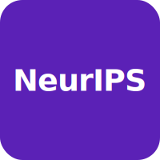 NeurIPS 2024 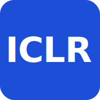 ICLR 2025 에서 본격적으로 다뤄지기 시작했습니다.
- multi-agent planning 분야는 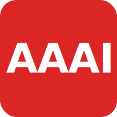 AAAI · 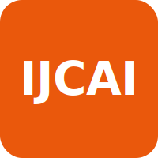 IJCAI 가 전통 강세, 최근 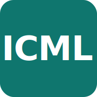 ICML 도 합류.

 

학회명 + 연도 묶음 (`.conf-badge` — `.conf-badges` 래퍼로 감싸기):

NeurIPS2025
ICML2025
ICLR2026
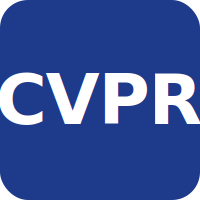CVPR2025
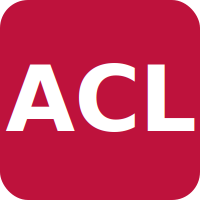ACL2025
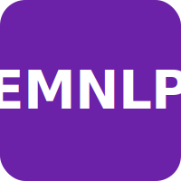EMNLP2025

---

# 패턴 6 — 공식 로고 (실제 학회 자산)

각 학회 공식 사이트에서 받은 brand asset. 비율이 제각각이라 height 기준으로 통일.

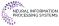NEURIPS

ICML

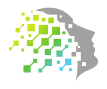ICLR

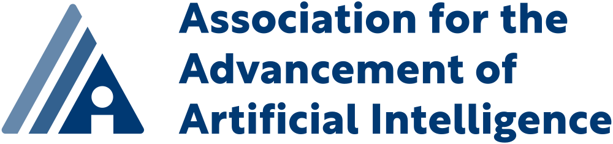AAAI

IJCAI

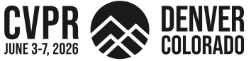CVPR

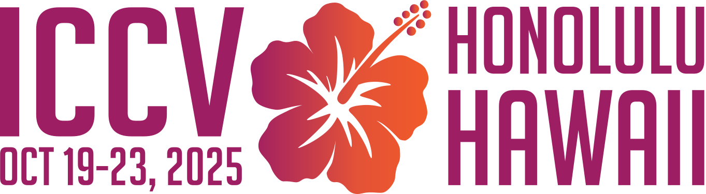ICCV

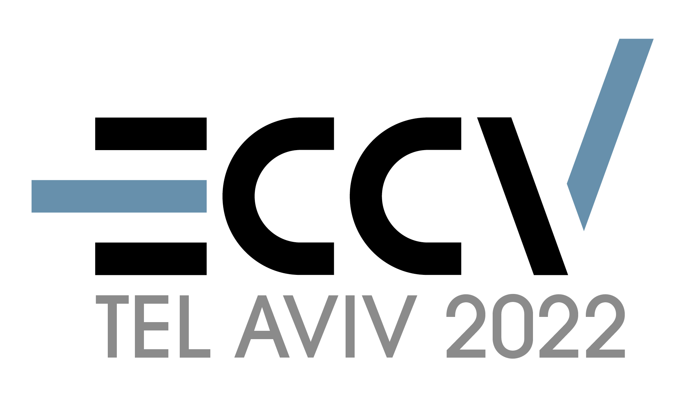ECCV

ACL

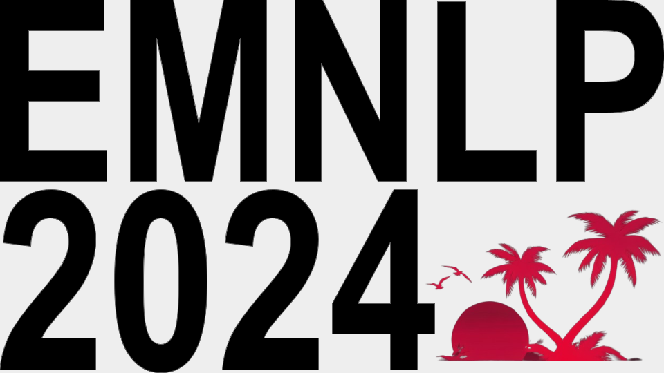EMNLP

---

# 패턴 7 — 공식 로고 인라인 / 카드 / 타임라인

## 인라인 사용

본문에 자연스럽게 끼워넣기. height 22px (xs) 또는 34px (sm) 추천.

-  의 LLM safety track 이 2024년부터 본격 확장.
-  의 오픈리뷰는 dLLM 분야 핵심 venue.

## 출판 타임라인 (공식 로고 버전)

2025

<strong>KLASS: KL-aware Sampling</strong> · diffusion LM selective forget. KL projection.

2026

<strong>Hierarchical dLLM Unlearning</strong> · token / span / concept 3계층 forget.

2025

<strong>Negative Preference Optimization</strong> · DPO 의 negative-only 변형.

2025

<strong>TOFU benchmark v2</strong> · synthetic author 200명 + paraphrase robustness.

---

# 패턴 8 — Hero 표지 (논문 발표 첫 슬라이드)

Accepted · Spotlight

KLASS — KL-aware Sampling for Selective Forgetting in Diffusion LMs

Lee · Kim · Park · Choi · DAMI Lab, 2025

---

# 패턴 9 — 논문 카드 grid (학회별 introduce)

2025 · Spotlight

KLASS — KL-aware Sampling for Selective Forgetting

Lee, Kim, Park, Choi (DAMI Lab)

diffusion LM 의 forget set 만 KL projection 으로 분리. retain quality 손실 0.4% 이내.

2026 · Poster

Hierarchical dLLM Unlearning across Token / Span / Concept

Qi, Zhang, DAMI collab.

3계층 forget granularity 동시 처리. TOFU 에서 SOTA, retain BLEU drop &lt; 1.

2025 · Oral

Negative Preference Optimization without Anchor Pairs

Park, Lee (DAMI Lab)

DPO 의 negative-only 변형. anchor-free 구조로 unlearning 안정성 +14%.

2025 · Findings

TOFU-2 — A Robust Benchmark for LLM Unlearning

Choi, Park, et al.

synthetic author 200명 + paraphrase / multi-hop QA 평가 추가. v1 대비 leakage 12% 감소.

---

# 패턴 10 — 수직 마일스톤 타임라인

## LLM Unlearning 라인 — 2024년 가을 ~ 2026년 봄

2024.07 · Honolulu

<strong>Workshop 발표</strong> · DPO-style negative loss 의 안정성 분석. peer 피드백으로 retain regularizer 도입 결정.

2025.05 → 2025.12

<strong>NeurIPS 2025 Spotlight</strong> · KLASS 본 논문 등재. KL-aware sampling 으로 forget vs retain trade-off 안정 영역 발견.

2025.10 → 2026.05

<strong>ICLR 2026</strong> · Hierarchical dLLM Unlearning 채택. KLASS 후속, granularity 3계층으로 확장.

2026.05 (under review)

<strong>ACL 2026 main</strong> · TOFU-3 benchmark + Membership Inference 통합. 결과 통보 6월 말.

2026.06 (submission)

<strong>EMNLP 2026 target</strong> · safety alignment retention 후속 연구. 7월 deadline.

---

# 패턴 11 — 연구실 출판 이력 heatmap

## DAMI Lab · 학회 × 연도 publication count

2022

1

·

·

1

·

1

·

·

·

·

2023

1

1

2

·

·

1

1

·

1

·

2024

2

1

2

1

·

1

·

1

2

1

2025

3

2

3

1

1

2

1

·

2

2

2026

1

2

3

1

·

1

·

·

1

·

0
1
2
3+

---

# 패턴 12 — 10개 학회 통일 카드 그리드

generic 자산이 있는 학회는 학회 공식 로고, 없는 학회는 모 조직 로고. 모두 동일한 카드 디자인. 라벨은 우리 슬라이드 표준 폰트 (Inter).

NeurIPS

Neural Information Processing Systems

ICML

Int'l Conference on Machine Learning

ICLR

Int'l Conference on Learning Representations

AAAI

Assoc. for Advancement of Artificial Intelligence

IJCAI

Int'l Joint Conference on Artificial Intelligence

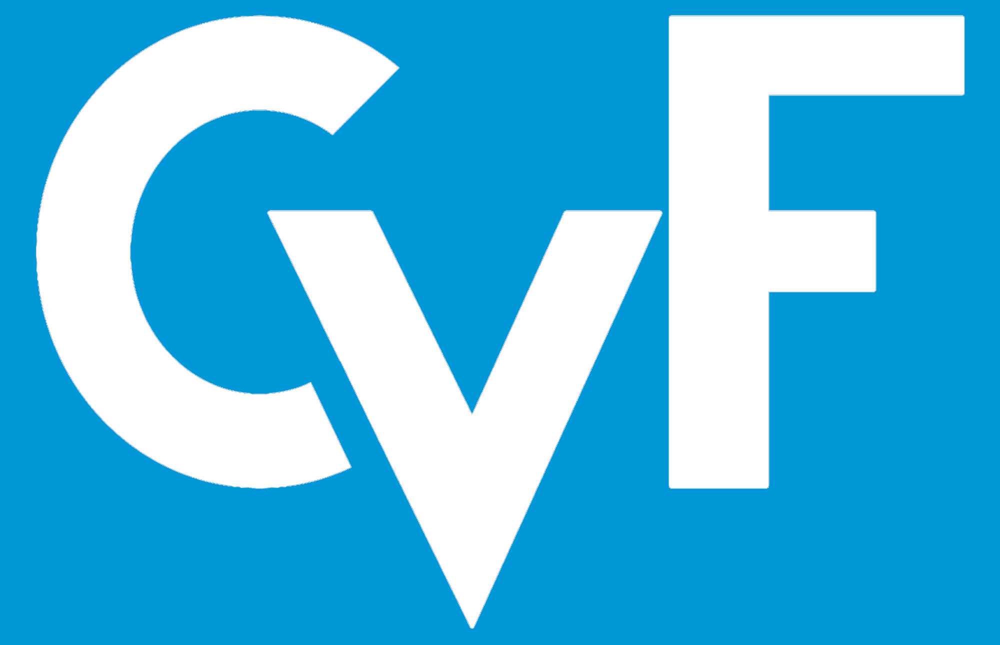

CVPR

CVF · IEEE Computer Society

ICCV

CVF · IEEE Computer Society

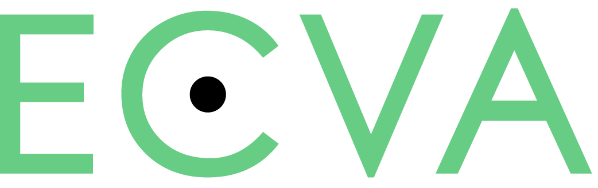

ECCV

European Computer Vision Association

ACL

Assoc. for Computational Linguistics

EMNLP

ACL SIGDAT

