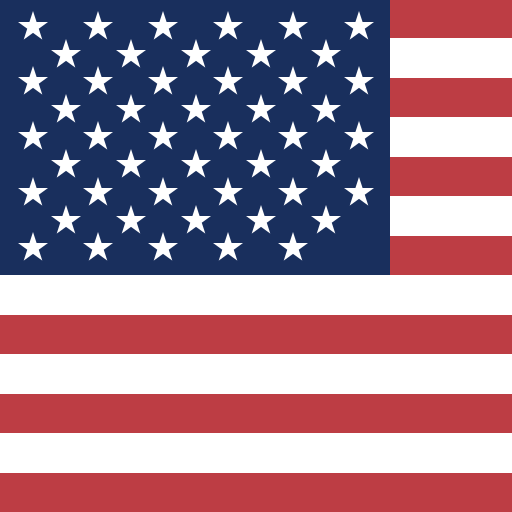
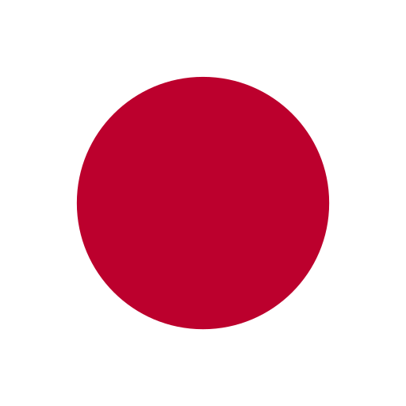
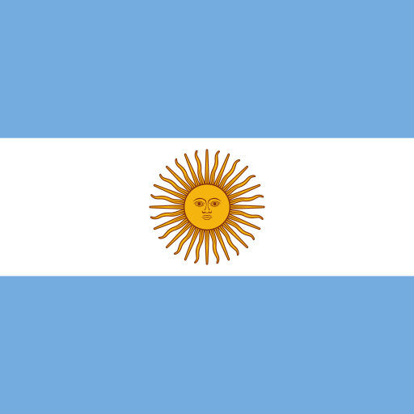
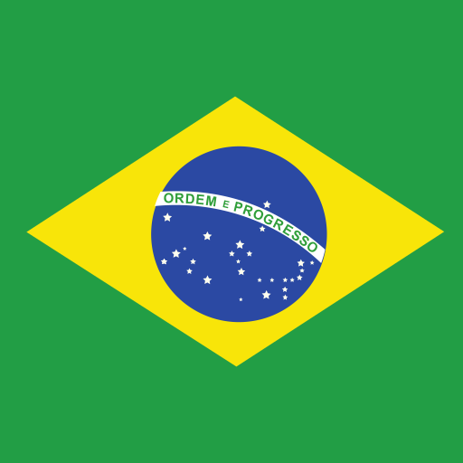
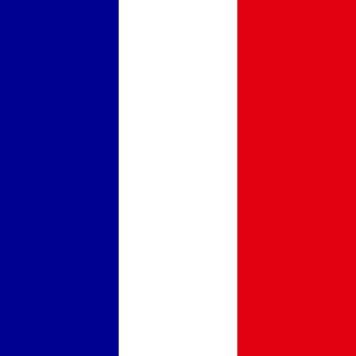
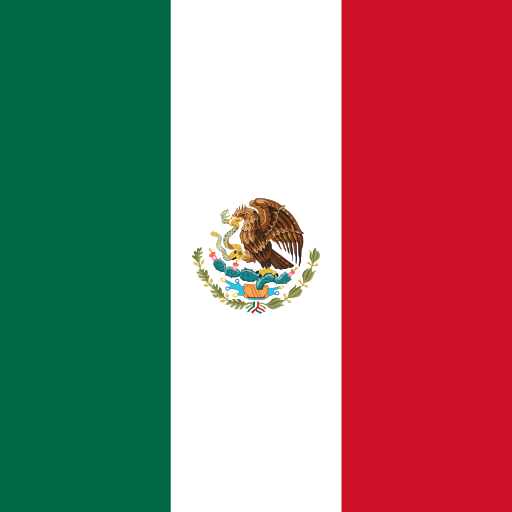
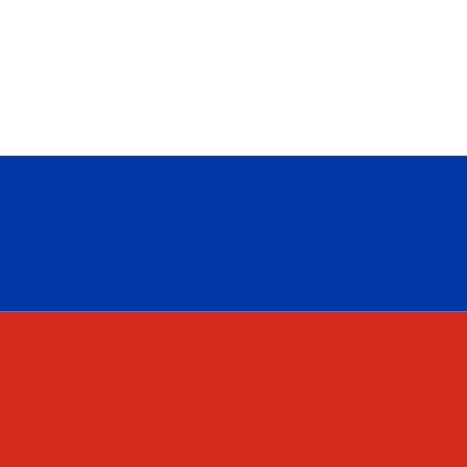
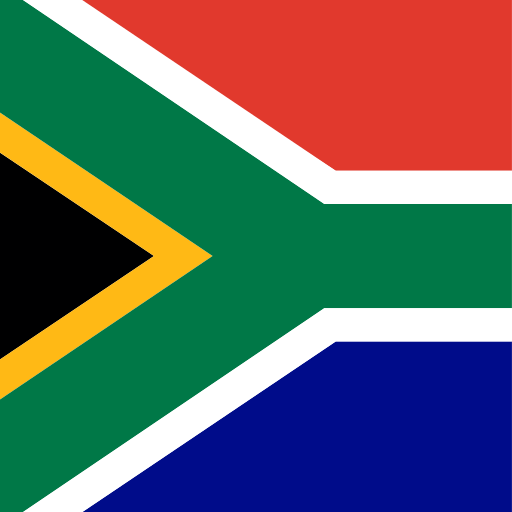
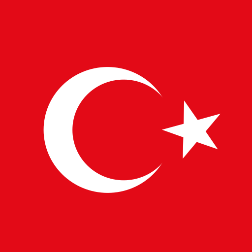

# Country Flags Component
## G20 + EU 원형 국기 — 슬라이드 양념

- 사용 가능 코드 (20개): AR · AU · BR · CA · CN · DE · FR · GB · ID · IN · IT · JP · KR · MX · RU · SA · TR · US · ZA · EU
- 사이즈 클래스: `.flag-xs(20)` · `.flag-sm(28)` · `.flag(44)` · `.flag-lg(72)` · `.flag-xl(120)`
- 모든 국기는 `flags/<code>.svg` 에서 `` 로 로드, `border-radius: 50%` 로 원형 디스크
- 본문 인라인부터 강조 카드, 카탈로그 그리드까지 같은 마크업 재사용

---

# 패턴 1 — 인라인 라벨 (작은 사이즈)

본문 흐름 안에서 국가를 살짝 표시하고 싶을 때.

- 한국  은 2026년 1월 AI 기본법을 시행했고, 미국  · 유럽연합  · 영국  도 같은 흐름.
- 일본  은 2025년 5월 AI 추진법, 중국  은 2024년 9월 TC260 표준을 발표.

 

플래그 + 라벨 묶음 (`.flag-row`):

KOREA
　

UNITED STATES
　

EUROPEAN UNION
　

JAPAN

---

# 패턴 2 — 카드형 (큰 국기 + 설명)

각 국가의 핵심 사실 한 덩어리씩.

대한민국 · AI 기본법

2026년 1월 시행. 고영향 AI 사업자에 안전성 시험·위험관리 체계 의무 부여.

EU · AI Act

2024년 8월 발효, 2026년 8월 전면 적용. high-risk 시스템 robustness 시험·인적 감독 의무.

미국 · NIST AI RMF GenAI

2024년 10월. 생성형 AI 13가지 위험 명시 + redteam·평가 가이드 표준화.

중국 · TC260 표준

2024년 9월 생성형 AI 보안 표준. 모델 등록·콘텐츠 라벨링·jailbreak 평가 의무.

---

# 패턴 3 — 카탈로그 그리드 (G20 + EU 전체)

ARGENTINA

AUSTRALIA

BRAZIL

CANADA

CHINA

FRANCE

GERMANY

INDIA

INDONESIA

ITALY

JAPAN

MEXICO

RUSSIA

SAUDI ARABIA

SOUTH AFRICA

SOUTH KOREA

TURKEY

UNITED KINGDOM

UNITED STATES

EUROPEAN UNION

---

# 패턴 4 — 규제 타임라인 (ask2026 5쪽 응용)

## 글로벌 AI 규제, 2024년 이후

2024.08 EU

<strong>EU AI Act 발효</strong> · high-risk 시스템 robustness 시험·인적 감독 의무. 2026.08 전면 적용.

2024.10 USA

<strong>NIST AI RMF GenAI Profile</strong> · 생성형 AI 13가지 위험 명시 + redteam 가이드 표준화.

2025.01 KOR

<strong>한국 AI 기본법 통과</strong> · 고영향 AI 사업자 안전성 시험 의무. 2026.01 시행.

2025.06 UK

<strong>AISI 평가 의무화</strong> · frontier model 출시 전 사전 평가 권고제 도입.

2024.09 CHN

<strong>중국 TC260 표준</strong> · 모델 등록·콘텐츠 라벨링·jailbreak 평가 의무. GB/T 45654 (2025) 통합.

2025.05 JPN

<strong>일본 AI 추진법</strong> · 보안·이용자 보호 의무 + AI 전략 본부 설치. 일본 최초 포괄 입법.

