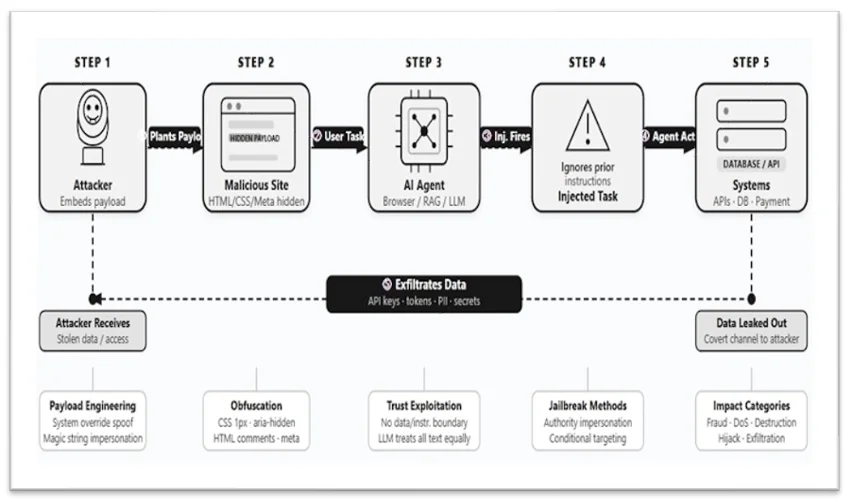

<!-- ============================================================ -->
<!-- 1. 표지 -->
<!-- ============================================================ -->

<!-- _class: title -->
<!-- _paginate: false -->

# Newspaper Component v3 — half-page 양식

DAMI Lab marp-skill 실험

2026-05-02 · AI Security 기사

---

<!-- ============================================================ -->
<!-- 2. Variant A — 한글 / 신문 좌측 절반 / 사진 없음 (기본형) -->
<!-- ============================================================ -->

# Variant A · 한글 · 좌측 절반 · 사진 없음 (기본형)

  

  
지티티코리아

  

    gttkorea.com
    2026.04.24
  

  
프롬프트 인젝션, 기업 AI 운영의 치명적 취약점으로

  

    
By 이향선 기자

    
엣지스캔(Edgescan) 의 ‘2026 취약점 통계 보고서’ 가 프롬프트 인젝션을 <mark>내부 엔터프라이즈 시스템의 치명적·고위험 취약점 상위 10개</mark> 에 포함시켰다.

    
보고서는 이 유형이 <mark>더 이상 이론적 위험이 아니라 실제 운영 시스템 평가에서 반복 확인되는 실전 위협</mark> 이라고 평가했다.

    
대기업의 약 37%가 발견된 취약점을 1년 이상 방치하고 있으며, 시정 속도가 발견 속도를 따라가지 못한다고 지적했다.

  

  
출처: gttkorea.com/news/articleView.html?idxno=25445

## 본 연구의 사회적 맥락
- 프롬프트 인젝션이 **이론 → 실전** 위협으로 전환
- 보안 산업이 이미 **상위 10대 취약점** 으로 분류

## 본 연구의 기여
- 동작 환경에서 **재현 가능한 평가 프로토콜** 제안
- 기업 운영 환경에 적용 가능한 **다층 방어 평가표**

---

<!-- ============================================================ -->
<!-- 3. Variant B — English / 신문 우측 절반 / 사진 없음 -->
<!-- ============================================================ -->

# Variant B · English · 우측 절반 · 사진 없음

## Why this article matters
- IPI is no longer **theory**, but a real-world attack vector
- Both **Google** and **Forcepoint** have observed the same wild patterns

## Connection to our research
- Our threat model **directly maps** to the kill-chain documented here
- We extend their findings with a **reproducible evaluation harness**

  

  
HELP NET SECURITY

  

    helpnetsecurity.com
    Apr 24, 2026
  

  
Indirect Prompt Injection Is Taking Hold in the Wild

  

    
By Zeljka Zorz, Editor-in-Chief

    
The open web is increasingly populated with hidden instructions designed to manipulate LLM-powered AI agents. <mark>Google and Forcepoint researchers documented real-world IPI embedded in web pages.</mark>

    
Common tactics: shrinking malicious text to a single pixel, draining its color to near-transparency, or simply tagging it as hidden via standard CSS — invisible to humans, executed by agents.

    
Google reported a <mark>32% relative rise</mark> in malicious-category attempts between Nov 2025 and Feb 2026.

  

  
Source: helpnetsecurity.com/2026/04/24/indirect-prompt-injection-in-the-wild/

---

<!-- ============================================================ -->
<!-- 4. Variant C — 한글 / 좌측 절반 / 사진 있음 (본문에 사진) -->
<!-- ============================================================ -->

# Variant C · 한글 · 좌측 절반 · 사진 있음

  

  
지티티코리아

  

    gttkorea.com
    2026.04.24
  

  
프롬프트 인젝션, 기업 AI 운영의 치명적 취약점으로

  

    
By 이향선 기자

    

      

      
엣지스캔 ‘2026 취약점 통계 보고서’ 발췌.

    

    
엣지스캔(Edgescan) 의 ‘2026 취약점 통계 보고서’ 가 프롬프트 인젝션을 내부 엔터프라이즈 시스템의 치명적·고위험 취약점 상위 10개에 포함시켰다.

    
보고서는 이 유형이 더 이상 이론적 위험이 아니라 실제 운영 시스템 평가에서 반복 확인되는 실전 위협이라고 평가했다.

    
대기업의 약 37%가 발견된 취약점을 1년 이상 방치하고 있다.

  

  
출처: gttkorea.com/news/articleView.html?idxno=25445

## 사진을 가져오는 경우
- 원 기사가 **시각 자료**(도식·인포그래픽) 를 핵심으로 쓸 때
- 단순 stock 이미지면 **굳이 안 가져옴**

## 이 기사의 경우
- 시각자료가 **분위기 일러스트** 라 우선순위 낮음
- 그래도 **시각적 임팩트** 가 필요한 슬라이드면 추가

---

<!-- ============================================================ -->
<!-- 5. Variant D — English / 우측 절반 / 사진 있음 (도식) -->
<!-- ============================================================ -->

# Variant D · English · 우측 절반 · 사진 있음 (도식)

## When to include the photo
- When the article ships a **diagram / kill-chain / data plot**
- When the slide is **explaining the figure itself**

## Here
- Help Net Security 의 IPI **5단계 kill chain** 도식
- 슬라이드 메인 메시지가 “**공격 흐름 설명**” 이라 사진 포함

  

  
HELP NET SECURITY

  

    helpnetsecurity.com
    Apr 24, 2026
  

  
Indirect Prompt Injection Is Taking Hold in the Wild

  

    
By Zeljka Zorz, Editor-in-Chief

    

      

      
Reconstructed 5-step IPI kill chain.

    

    
Hidden instructions in web pages are quietly steering LLM-powered agents into data exfiltration. <mark>Researchers from Google and Forcepoint documented the kill chain end-to-end.</mark>

    
Tactics range from 1px hidden text to invisible CSS — invisible to humans, executed by agents. Google logged a <mark>32% rise</mark> between Nov 2025 and Feb 2026.

  

  
Source: helpnetsecurity.com/2026/04/24/indirect-prompt-injection-in-the-wild/

---

<!-- ============================================================ -->
<!-- 6. Variant E — 한글 / 우측 절반 / 사진 없음 -->
<!-- ============================================================ -->

# Variant E · 한글 · 우측 절반 · 사진 없음

## OpenAI 자기 평가
- 단일 해법이 **없음** 을 공식 인정
- 다층 방어 + 폐쇄 루프 검증 = 현실 솔루션

## 본 연구의 위치
- 다층 방어 중 **평가/검증** 단계의 표준화
- “공격 비용 인상” 이라는 동일 프레임에 부합

  

  
데일리시큐

  

    dailysecu.com
    2025.12.26
  

  
오픈AI “프롬프트 인젝션, 장기 보안 과제…단일 해법 없다”

  

    
By 길민권 기자

    
오픈AI 가 프롬프트 인젝션 공격을 <mark>“장기적인 보안 과제”</mark> 로 규정하며, <mark>완벽하게 해결됐다고 말할 수 있는 단일 해법은 없다</mark> 고 공식 입장을 밝혔다.

    
회사는 모델 정렬만으로는 외부 콘텐츠에 숨겨진 악성 명령을 모두 막을 수 없다고 인정했다. 학습 데이터 보강 · 입력 분리 · 사용자 재확인 · 출력 후처리 등 네 단계의 방어를 결합해야 한다고 설명했다.

    
전문가들은 “책임 있는 공급자가 한계를 솔직히 공개한 신호” 로 평가했다.

  

  
출처: dailysecu.com/news/articleView.html?idxno=203808

---

<!-- ============================================================ -->
<!-- 7. Variant F — 영문 / 좌측 절반 / 사진 있음 (사람 얼굴) -->
<!-- ============================================================ -->

# Variant F · English · 좌측 절반 · 사진 있음 (배너)

  

  
BLEEPING COMPUTER

  

    bleepingcomputer.com
    Apr 27, 2026
  

  
Deepfake Voice Attacks Are Outpacing Defenses

  

    
By Marshall Bennett, Adaptive Security

    

      

      
“Three seconds of audio is enough.”

    

    
AI-generated voice clones are powering executive impersonation fraud at unprecedented scale. Voice deepfake incidents <mark>rose 680% year-over-year</mark> in 2025.

    
The U.S. alone logged over 100,000 attacks, including a single <mark>$11 M fraud directly attributed to voice cloning</mark>. Out-of-band verification is becoming the practical baseline.

  

  
Source: bleepingcomputer.com/news/security/deepfake-voice-attacks-are-outpacing-defenses

## 본 연구와 인접한 위협
- 본 연구는 **텍스트 기반 IPI** 가 주제
- 음성 딥페이크는 **다른 modality** 의 같은 패턴

## 함의
- 단일 채널 방어는 **곧 무력화**
- 공통 결론: **out-of-band 검증** 의 필요성

---

<!-- ============================================================ -->
<!-- 8. Variant G — 작은 클립 두 개 비교 -->
<!-- ============================================================ -->

# Variant G · 작은 클립 두 개 비교

  

  
데일리시큐

  

    dailysecu.com
    2025.12.26
  

  
오픈AI “프롬프트 인젝션, 장기 보안 과제”

  

    
오픈AI 가 프롬프트 인젝션을 “장기 보안 과제” 로 규정. 단일 해법 없이 다층 방어로 공격 비용을 올리는 접근이 현실적이라 강조했다.

  

  
출처: dailysecu.com/news/articleView.html?idxno=203808

  

  
HELP NET SECURITY

  

    helpnetsecurity.com
    Apr 24, 2026
  

  
Indirect Prompt Injection Taking Hold in the Wild

  

    
Google &amp; Forcepoint document IPI in real web pages: 1px hidden text, transparent CSS, hidden meta — invisible to humans, executed by agents. <mark>32% rise from late 2025.</mark>

  

  
Source: helpnetsecurity.com/2026/04/24/indirect-prompt-injection-in-the-wild/

## 비교 포인트
- **공급자 시각** (OpenAI) vs **관측 시각** (보안 리서치)
- 두 기사 모두 **다층 방어** 결론
- 본 연구가 **평가 프레임** 으로 이 흐름을 잇는다

## 작은 클립의 역할
- 개별 기사 자체는 부차적
- **공통 흐름** 을 짚는 시각자료로 기능

---

<!-- ============================================================ -->
<!-- 12. 영→한 번역 케이스 (masthead 영문 유지, 본문 한글) -->
<!-- ============================================================ -->

# Variant H · 영문 기사 → 한글 번역

  

  
BLEEPING COMPUTER

  

    bleepingcomputer.com
    2026.04.27 · 한글 번역
  

  
딥페이크 음성 공격, 방어를 앞지르고 있다

  

    
By Marshall Bennett · Adaptive Security

    
AI 가 합성한 음성 클론이 임원을 사칭한 송금 사기를 <mark>전례 없는 규모</mark> 로 확대하고 있다. 음성 딥페이크 사고는 2025년에 <mark>전년 대비 680% 급증</mark> 했다.

    
미국 한 곳에서만 10만 건 이상 공격이 보고됐으며, 그중 단일 사례로 <mark>1,100만 달러 사기</mark> 가 음성 클로닝에 직접적으로 귀속됐다. 음성·발신번호 만으로는 더 이상 신원을 검증할 수 없다.

    
전문가들은 사전 약속 코드워드, 콜백 절차, 별도 채널을 통한 2차 승인 같은 <mark>out-of-band 검증</mark> 을 실무 표준으로 권고하고 있다.

  

  
원문: bleepingcomputer.com/news/security/deepfake-voice-attacks-are-outpacing-defenses

## 영→한 번역 규칙
- **신문사명 (masthead) 은 영문 유지** — 출처 식별
- **헤드라인·본문은 한글 번역** — 청중 가독성
- 메타바에 `한글 번역` 표시
- 출처 링크는 `원문:` 으로 prefix
- 폰트: 자동으로 Hahmlet (헤드) + Noto Serif KR (본문) 적용

## `<mark>` 하이라이트 사용처
- 핵심 수치 (`680% 급증`, `1,100만 달러`)
- 핵심 결론 (`out-of-band 검증`)
- 인용문 (큰따옴표 안 강조 어구)

